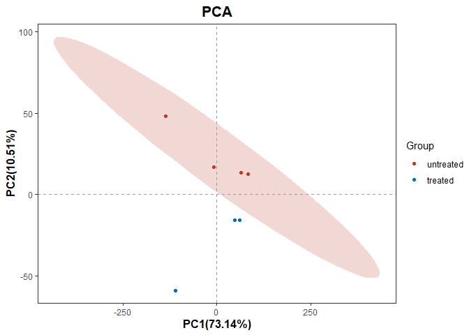

<!-- README.md is generated from README.Rmd. Please edit that file -->

# BioinfoRtools

<!-- badges: start -->
<!-- badges: end -->

The BioinfoRtools is A comprehensive bioinformatics R package toolbox

## Installation

You can install the development version of BioinfoRtools like so:

``` r
# FILL THIS IN! HOW CAN PEOPLE INSTALL YOUR DEV PACKAGE?
devtools::install_github("YulongQin/BioinfoRtools")
```

## Example

This is a basic example which shows you how to conduct differential
analysis of expression profiles:

``` r
library(BioinfoRtools)
#> 
#> 载入需要的程辑包：Biobase
#> 载入需要的程辑包：BiocGenerics
#> 
#> 载入程辑包：'BiocGenerics'
#> The following objects are masked from 'package:stats':
#> 
#>     IQR, mad, sd, var, xtabs
#> The following objects are masked from 'package:base':
#> 
#>     anyDuplicated, aperm, append, as.data.frame, basename, cbind,
#>     colnames, dirname, do.call, duplicated, eval, evalq, Filter, Find,
#>     get, grep, grepl, intersect, is.unsorted, lapply, Map, mapply,
#>     match, mget, order, paste, pmax, pmax.int, pmin, pmin.int,
#>     Position, rank, rbind, Reduce, rownames, sapply, setdiff, sort,
#>     table, tapply, union, unique, unsplit, which.max, which.min
#> Welcome to Bioconductor
#> 
#>     Vignettes contain introductory material; view with
#>     'browseVignettes()'. To cite Bioconductor, see
#>     'citation("Biobase")', and for packages 'citation("pkgname")'.
#> 
#> 载入程辑包：'DynDoc'
#> The following object is masked from 'package:BiocGenerics':
#> 
#>     path
#> 
ls(package:BioinfoRtools)
#> Warning in ls(package:BioinfoRtools): 'package:BioinfoRtools'被转换成字符串
#>  [1] "%>%"                   "Clinic_corr"           "coldata"              
#>  [4] "countdata"             "DEGs_DESeq2"           "DEGs_Wilcoxon"        
#>  [7] "genes"                 "get_intersection"      "get_intersection_list"
#> [10] "get_union"             "get_union_list"        "GO_KEGG"              
#> [13] "GSEA_GO_KEGG"          "GSVA_ssGSEA"           "HTmap"                
#> [16] "Mfuzz_pipeline"        "miRNA_mRNA"            "PCA"                  
#> [19] "pubmed_search"         "shorten_names"         "split_paste"          
#> [22] "WGCNA_pipeline"

## basic example code
res <- DEGs_DESeq2(
  countdata=countdata,
  group=coldata$condition,
  case = "treated",
  ctrl = "untreated",
  covariate = NULL,
  updown_thres = 1,
  rate_sap = 0.1,
  OUT_df_index = FALSE,
  updown_index = FALSE,
  p_value = 0.05,
  padj_value = 0.05,
  grp_nm = "DEGs_DESeq2",
  dir_nm = "DEGs_DESeq2"
)
#> Warning in dir.create(output_dir, recursive = T):
#> '.\outputdata\DEGs_DESeq2\DEGs_DESeq2'已存在
#> converting counts to integer mode
#> estimating size factors
#> estimating dispersions
#> gene-wise dispersion estimates
#> mean-dispersion relationship
#> final dispersion estimates
#> fitting model and testing
```

This is a basic example which shows you how to conduct enrichment
analysis of gene sets:

``` r
GO_KEGG(
  updown = genes,
  simplify_index = F,
  maxGSSize = 500,
  grp_nm = "GO_KEGG",
  dir_nm = "GO_KEGG"
)
#> Warning in dir.create(output_dir, recursive = T):
#> '.\outputdata\GO_KEGG\GO_KEGG'已存在
#> Warning in dir.create(photo_dir, recursive = T):
#> '.\photo\GO_KEGG\GO_KEGG'已存在
#> 'select()' returned 1:many mapping between keys and columns
#> png 
#>   2
```

Here’s how to use some of the graphing functions`PCA` and `HTmap`:

``` r
PCA(countdata=countdata,
    group=coldata$condition, 
    grp_nm = "PCA", 
    scale = T)
#> Too few points to calculate an ellipse
```


